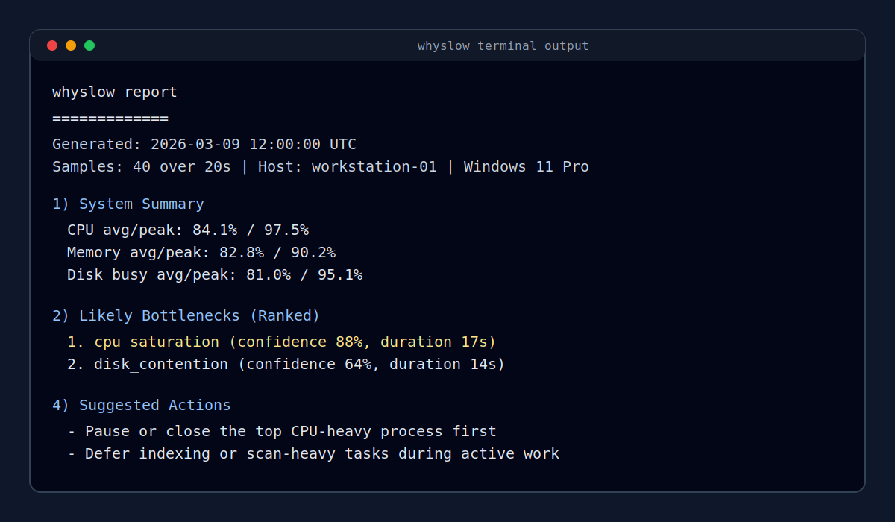

# whyslow

Diagnose why a Windows machine feels slow, in the terminal.

A Windows-first diagnostic CLI that identifies likely bottlenecks, explains the evidence, and suggests what to do next.



## Install

1. GitHub Releases (recommended for most users)
   - Download the latest `whyslow-windows-x86_64.exe` from [GitHub Releases](https://github.com/MuhammedZohaib/whyslow/releases).
2. crates.io
   ```powershell
   cargo install whyslow
   ```
3. Build from source
   ```powershell
   git clone https://github.com/MuhammedZohaib/whyslow.git
   cd whyslow
   cargo build --release
   .\target\release\whyslow.exe
   ```

## Quick Start

```powershell
whyslow
whyslow --json
whyslow --watch 5
```

## Example Output

```text
whyslow report
=============
Generated: 2026-01-15 10:30:00 UTC
Samples: 40 over 20s
Host: workstation-01 | Windows 11 Pro

1) System Summary
- CPU avg/peak: 89.2% / 98.7%
- Memory avg/peak used: 86.1% / 92.4%
- Avg process count: 254.0
- Disk read/write: 45.0 MB/s / 12.0 MB/s
- Disk busy avg/peak: 87.4% / 98.2%
- Disk latency avg/peak: 24.5 ms / 80.0 ms
- Network down/up avg: 2.5 MB/s / 0.8 MB/s

2) Likely Bottlenecks (Ranked)
1. cpu_saturation (confidence 91%, duration 18s)
   Explanation: CPU stayed high during most of the sampling window.

4) Suggested Actions
- Pause or close the top CPU-heavy process first
- Check whether antivirus scans, indexing, or build tasks are running
```

## Why Not Task Manager?

Task Manager is excellent for raw counters. `whyslow` is for diagnosis.

- It samples over time instead of a single moment.
- It ranks likely bottlenecks with confidence scores.
- It maps process evidence to plain-language explanations.
- It outputs stable JSON for automation and incident notes.

## Features

- Windows-first system sampling (CPU, memory, disk, network, process families)
- Deterministic diagnosis rules (no cloud dependency)
- Ranked bottlenecks with evidence and suggested actions
- Terminal watch mode for repeated checks
- Export to JSON or Markdown report

## Limitations

- Windows-first support today (Linux/macOS are not a target yet)
- Some disk counters may require elevated privileges or may be unavailable on specific hosts
- Thermal metrics are not currently included
- Confidence scores are heuristic, not ground truth

## Roadmap

- Add network bottleneck diagnosis
- Add per-process disk I/O table in default output
- Add snapshot export mode for scheduled runs
- Improve confidence calibration and rule explainability
- Add WSL-specific diagnosis rules

## CLI Help

```powershell
whyslow --help
whyslow --version
```

## Contributing

See [CONTRIBUTING.md](CONTRIBUTING.md) for development setup, coding standards, and how to add diagnosis rules.

## Security and Privacy

See [SECURITY.md](SECURITY.md). `whyslow` performs local-only analysis and does not upload telemetry by default.

## License

Licensed under MIT OR Apache-2.0. See [LICENSE](LICENSE).


